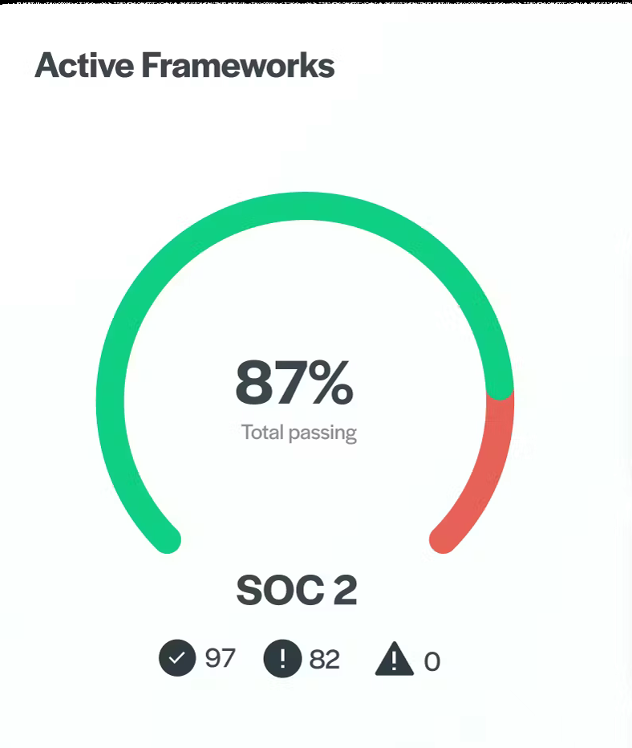

# Saillent SOC 2 Type 2 Case Study – Zero Findings in 28 Days 🚀

> 🚨 Redacted real-world engagement with a logistics SaaS company preparing for enterprise contracts.

---

## 📌 Client Overview
**Client:** Saillent Inc. *(Cloud Logistics SaaS)*  
**Objective:** Fast-track SOC 2 Type 2 in 30 days to close $5.2M contract with Fortune 500 buyer  
**Timeline:** Jan 15 – Feb 12, 2025

---

## 🔍 Pre-Engagement Assessment

| Trust Service Principle | Initial Score | Critical Issues |
|-------------------------|---------------|-----------------|
| CC6.1 Access Control    | 32%           | Overprivileged IAM, No MFA |
| CC7.1 Vulnerability Mgmt| 28%           | No vuln scanning, 58 critical CVEs |
| CC8.1 Change Mgmt       | 41%           | No config drift alerts |

---

---

## 🛠️ Remediation Actions

1. **Compliance-as-Code**: Terraform with guardrails for AWS resources  
2. **Automation**: AWS Config + Lambda for evidence tracking  
3. **IAM Hardening**: MFA, session logging, permission boundaries  
4. **Vulnerability Mgmt**: Tenable.io integration in CI/CD  
5. **Continuous Monitoring**: Live Streamlit dashboards  

---

## ✅ Final Audit Outcome

| Metric | Before | After |
|--------|--------|-------|
| Compliance Score | 45% | **98%** ✅ |
| Audit Exceptions | 22 | **0** 🎯 |
| Manual Work | 120 hrs/month | **32 hrs/month** |
| Contract Won | ✖ | **$5.2M Secured** 💰 |

---

## 🔐 Deliverables
- [`executive-summary-redacted.pdf`](./executive-summary-redacted.pdf)
- [`compliance-score-progression.png`](./compliance-score-progression.png)
- `evidence/` folder (coming soon...)

> All sensitive client information redacted. Infrastructure details modified to preserve confidentiality.

